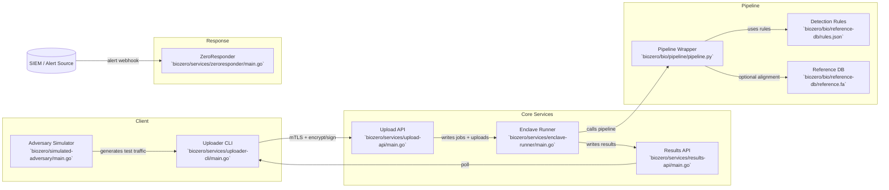

# BioZero Project Flow Guide

## Markdown Flow Chart (Mermaid)

## Project Guide (What goes in, what happens, what comes out)

### 1) Inputs (What goes in)
- **Genomic files** (e.g., FASTQ) uploaded by the Uploader CLI.
- **Client identity** via mTLS certificates and `client_id`.
- **Optional cryptographic metadata** (encrypted key bundle + signature) generated by the CLI.
- **Reference data** (FASTA) for alignment steps.

### 2) Processing (What happens)
- **Uploader CLI** encrypts and signs the payload (optional) and sends it over mTLS.
- **Upload API** validates size, hash, and client identity; stores the upload and job metadata.
- **Enclave Runner** pulls jobs, verifies signatures, decrypts the payload, and runs the pipeline wrapper.
- **Pipeline Wrapper** performs:
  - FASTQ stats (always)
  - fastp QC (if installed)
  - minimap2 alignment (if reference present)
  - bcftools/samtools variant calling (if available)
- **Detection Rules** apply simple threat scoring (file size + name patterns).

### 3) Outputs (What comes out)
- **Results JSON** returned via Results API containing:
  - hashes, byte counts, pipeline output
  - detection score and reason
  - signature + decryption status
- **Evidence artifacts** for tests and validation (logs, CLI output, responder actions).
- **IR actions** (ZeroResponder) such as blocklist/revocation/quarantine when alerts are triggered.

## Real‑World Use Cases
- **Secure lab‑to‑cloud genomics**: researchers encrypt data locally, the platform processes it in a trusted pipeline, and returns results without exposing raw sequences.
- **Bio‑threat detection**: detection rules and analysis outputs can be piped into a SOC/SIEM for monitoring and alerting.
- **Incident response training**: ZeroResponder simulates automated containment and evidence logging.
- **Sustainment engineering**: change/test/evidence logs demonstrate disciplined change control.

## Operational Notes
- In production, keys should be managed by HSM/KMS, not local files.
- The pipeline wrapper is a minimal example; replace with validated bioinformatics workflows.
- Results API auth should map to real identities/roles rather than a single header check.
